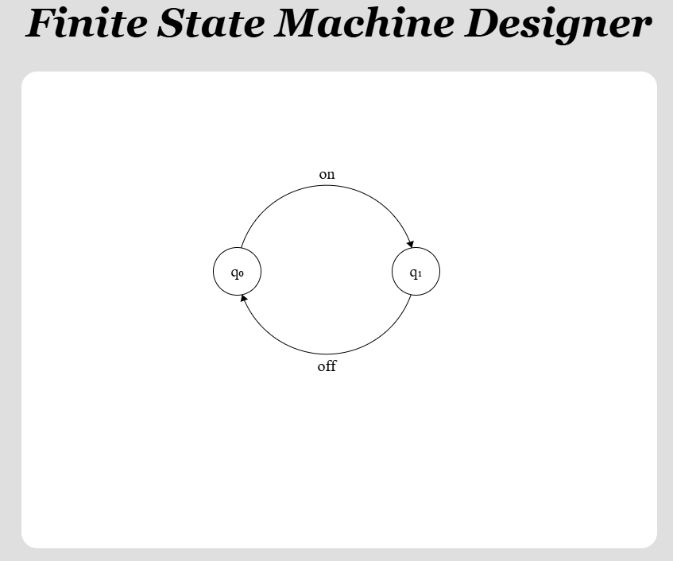

# Finite State Machine Designer

**Original Website**: [http://madebyevan.com/fsm/](http://madebyevan.com/fsm/)

**Updated Website**: [https://raredrops.github.io/fsm](https://raredrops.github.io/fsm)

## Description

The Finite State Machine Designer is a JavaScript-based application that allows users to create and manipulate finite state machines (FSMs) visually. It provides functionality for converting LaTeX commands into their corresponding Unicode characters, rendering mathematical symbols, and exporting drawings in LaTeX format.

## Features

- **LaTeX Command Conversion**: Converts common LaTeX commands (e.g., Greek letters, mathematical operators) into Unicode characters.
- **Drawing Capabilities**: Allows users to create and manipulate drawings using a canvas, with support for exporting to LaTeX.
- **Export to LaTeX**: Provides functionality to export drawings as LaTeX code, suitable for use in LaTeX documents.
- **Customizable**: Easily extendable to add more LaTeX shortcuts or drawing features.

## Changelog

* **1.1.0** - Added LaTeX typing functionalities, including support for Greek letters and mathematical operators.
* **1.0.0** - Initial release of the Finite State Machine Designer by Evan Wallace(Original Creator).

## Contributing

Contributions are welcome! If you have suggestions for improvements or new features, please open an issue or submit a pull request.

## License

MIT © [RareDrop](https://github.com/RareDrops/fsm) 

## Acknowledgments

- Thanks to [Evan Wallace](http://madebyevan.com) for creating this amazing tool!
